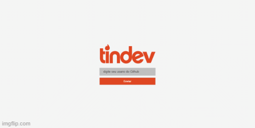

<h1 align="center">
 
  
 
 
</h1>

A project prepared by Rocketseat developed during the week OmniStack 8

  

{: height="350px" style="float:left; padding-right:10px"} [myimg](./assets/demo-mobile.gif){: height="350px" style="float:left"}

## Tech Stacks

- :atom_symbol: **[React Js](https://reactjs.org)** — A JavaScript library for building user interfaces
- :atom_symbol: **[React Native](https://reactnative.dev/)** — A lib that provides a way to create native apps for Android and iOS
- :arrows_counterclockwise: **[Typescript](https://www.typescriptlang.org/)** — A superset of JavaScript that adds typing and some other features to the language
- :toolbox: **[Expo](https://expo.io/)** — An open-source platform for making universal native apps for Android, iOS, and the web with JavaScript and React.
- :gear: **[Node Js](https://nodejs.org/en/)** — A multiplatform software, which executes JavaScript code on the backend and frontend / interface
- :closed_lock_with_key: **[MongoDB](https://docs.mongodb.com/)** — An multiplatform open source database oriented software
- :rocket: **[Socket IO](https://socket.io/)** — A library for realtime web applications

## Features

* Expo was used to create the native application.
* The Websocket connection was persisted in the database in order to make the server more stateless.
* The back-end and front-end were deployed using the "Heroku" tool synchronized with github.  

## Getting started

1. Clone this repo using `git clone https://github.com/S4nt1ag0/Tindev.git`
2. Move yourself to the appropriate directory: `cd Tindev` 
3. Run `yarn` to install dependencies 

### Getting started with the backend server

1. Move yourself to the backend folder: `cd server`
2. Create a `.env` file and add the MongoDB url connection in `DATABASE_URI` field
3. Run `yarn runBackend` to start the server

### Getting started with the frontend app

1. Move yourself to the frontend folder: `cd web`
2. Create a `.env` file and add the url and the port where the API are running in `REACT_APP_API_URL` field
3. Run `yarn start` to start the web application

### Getting started with the mobile app

1. Move yourself to the mobile folder: `cd mobile`
2. Create a `.env` file and add the url and the port where the API are running in `REACT_APP_API_URL` field
3. Run `expo start` to start the mobile application and scanned the QR code with your smartphone or choose the option for run in your emulator

Note: if you are running yuor api in localhost, remember that the localhost address change for your smartphone or you emulator, in this case 
get the url that expo show when you run `expo start` and add the port of localhost where the server are running.

Note2: if you will use emulator remember start the emulator before choose initialize the mobile application in emulador when run 'expo start'

## License 

This project is licensed under the MIT License - see the [LICENSE](https://opensource.org/licenses/MIT) page for details.
